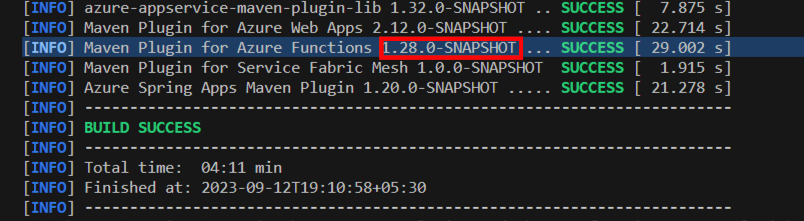
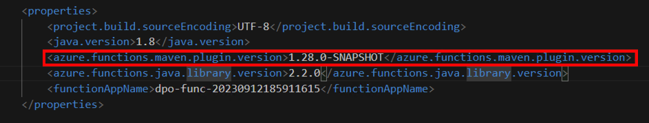
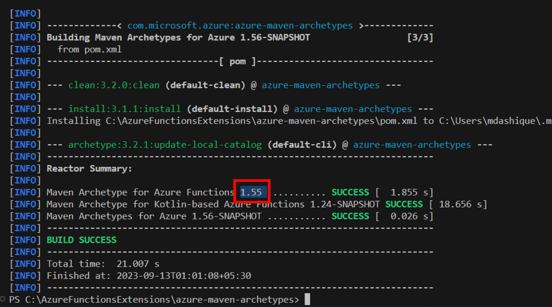

## Steps to validate Java templates in local machine

1. Install azure-maven-plugins with from root of azure-maven-plugins repo
```
mvn clean install
```
2. Once installation is complete, copy the Azure Functions version and update azure.functions.maven.plugin.version in the Created Azure function Java project's pom.xml.


    Update the version in pom.xml

    
3. Create azure functions with newly added templates
```
mvn azure-functions:add
```

## Steps to Validate specific java template with archetypes

1. Install azure-maven-plugins with from root of azure-maven-plugins repo
```
mvn clean install
```
2. Pick the version from installed azure-maven-plugins shown below

3. Update above version in [this pom.xml](https://github.com/microsoft/azure-maven-archetypes/blob/develop/azure-functions-archetype/src/main/resources/archetype-resources/pom.xml) for azure.functions.maven.plugin.version. This file will be in [azure-maven-archetypes](https://github.com/microsoft/azure-maven-archetypes)

```
<azure.functions.maven.plugin.version>1.28.0-SNAPSHOT</azure.functions.maven.plugin.version>
```

4. Install [azure-maven-archetypes](https://github.com/microsoft/azure-maven-archetypes) by running below command in root folder of [azure-maven-archetypes](https://github.com/microsoft/azure-maven-archetypes).
```
mvn clean install  archetype:update-local-catalog
```

5. From above installation, copy the version number as shown below
 and use in below command to create the function app. Replace DaprPublishOutputBinding with your trigger or binding template name.

```
mvn archetype:generate -DarchetypeGroupId="com.microsoft.azure" -DarchetypeArtifactId=azure-functions-archetype -DarchetypeVersion="1.55" -DarchetypeCatalog=local -Dtrigger=DaprPublishOutputBinding
```